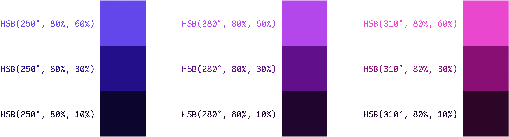
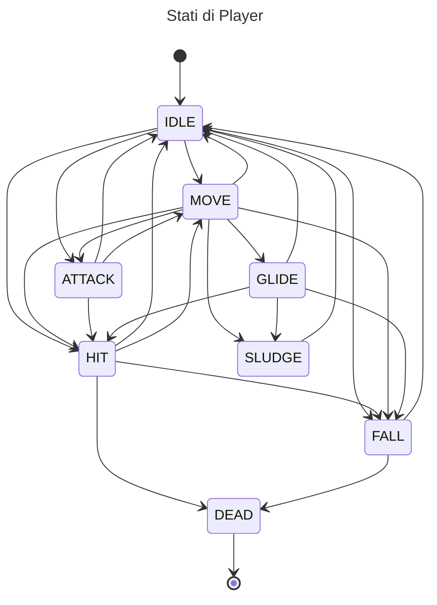
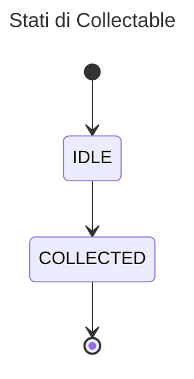

### Maven

> [!TIP]
> Eseguire `mvn` compila ed esegue il progetto in un colpo solo.

Lifecycle phases:
  - `mvn clean` rimuove `target/` dopo la build
  - `mvn compile` compila il progetto
  - `mvn exec:exec` esegue il progetto compilato
  - `mvn package` crea l'archivio `jar` compreso di dipendenze

Le fasi si possono concatenare, esempio: `mvn clean compile` rimuove `target/` e ricompila il progetto da capo.

### Colori

Il menù principale usa una palette **monocromatica** basata sul viola (`HSB(280, 80, 60)`). Elementi dell'interfaccia che si intende fare risaltare usano i **colori vicini**, blu e rosa.

### Entità

```mermaid
---
Title: Gerarchia dell'ereditarietà dell'entità
---
classDiagram
    Entity <|-- DynamicEntity
    Entity <|-- Collectable
    Entity <|-- Environment

    Environment <|-- Barrier
    Environment <|-- Chest
    Environment <|-- Ground
    Environment <|-- Wall
    Environment <|-- Stair
    Environment <|-- Trap

    Trap <|-- IcyFloor
    Trap <|-- Sludge
    Trap <|-- SpikedFloor
    Trap <|-- Totem
    Trap <|-- Trapdoor
    Trap <|-- Void

    Collectable <|-- Coin
    Collectable <|-- Health
    Collectable <|-- Key
    Collectable <|-- PowerUp

    PowerUp <|-- Agility
    PowerUp <|-- AngelRing
    PowerUp <|-- BrokenArrows
    PowerUp <|-- CoinOfGreed
    PowerUp <|-- ColdHearth
    PowerUp <|-- GoldArrow
    PowerUp <|-- HealingFlood
    PowerUp <|-- HedgehogSpines
    PowerUp <|-- HobnailBoots
    PowerUp <|-- HolyShield
    PowerUp <|-- HotHeart
    PowerUp <|-- KeySKeeper
    PowerUp <|-- LongSword
    PowerUp <|-- PieceOfBone
    PowerUp <|-- SlimePiece
    PowerUp <|-- StoneBoots
    PowerUp <|-- VampireFangs

    DynamicEntity <|-- LiveEntity
    DynamicEntity <|-- Projectile

    LiveEntity <|-- Enemy
    LiveEntity <|-- Player

    Enemy <|-- Beetle
    Enemy <|-- BigSlime
    Enemy <|-- Skeleton
    Enemy <|-- Slime
    Enemy <|-- Wraith
    Enemy <|-- Zombie

    Player <|-- Knight
    Player <|-- Archer
    Player <|-- Ninja

    Projectile <|-- Arrow
    Projectile <|-- SlimeShot
```

In ogni istante del gioco ciascuna `Entity` si trova in uno _stato_. La `StateMachine`, che non è altro che un [automa a stati finiti](https://it.wikipedia.org/wiki/Automa_a_stati_finiti), gestisce la definizione degli stati e degli archi che regolano il passaggio tra essi.

### Attribuzione

- Il ninja è una versione modificata di [Superpowers Asset Packs](https://github.com/sparklinlabs/superpowers-asset-packs) (CC0)
- Il look & feel per swing è [FlatLaf](https://www.formdev.com/flatlaf/) (Apache-2.0)
- Le risorse audio sono tutte _royalty free_ e provengono da
  - [DungeonRush](https://github.com/rapiz1/DungeonRush/tree/master/res/audio)
  - [Pixabay](https://pixabay.com/)
- Font per l'interfaccia: [VT323](https://fonts.google.com/specimen/VT323)
- Le citazioni dei personaggi nella schermata iniziale e i messaggi del dialogo di morte sono generati da [ChatGPT](https://chatgpt.com/)
- Varie risorse provengono da [itch.io](https://itch.io/gameView-assets), i file sono accompagnati dalle rispettive licenze.
- Alcune icone provengono da [flaticon.com](https://www.flaticon.com)