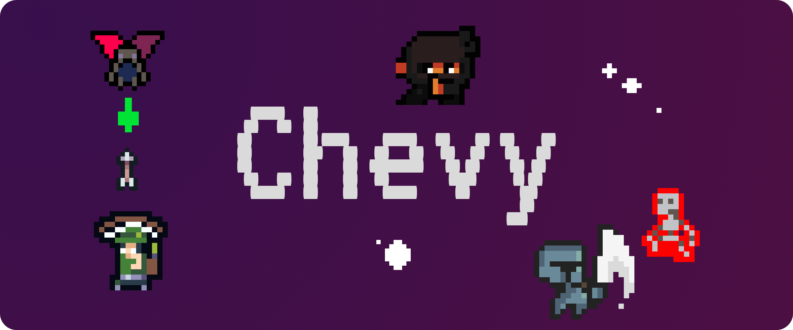
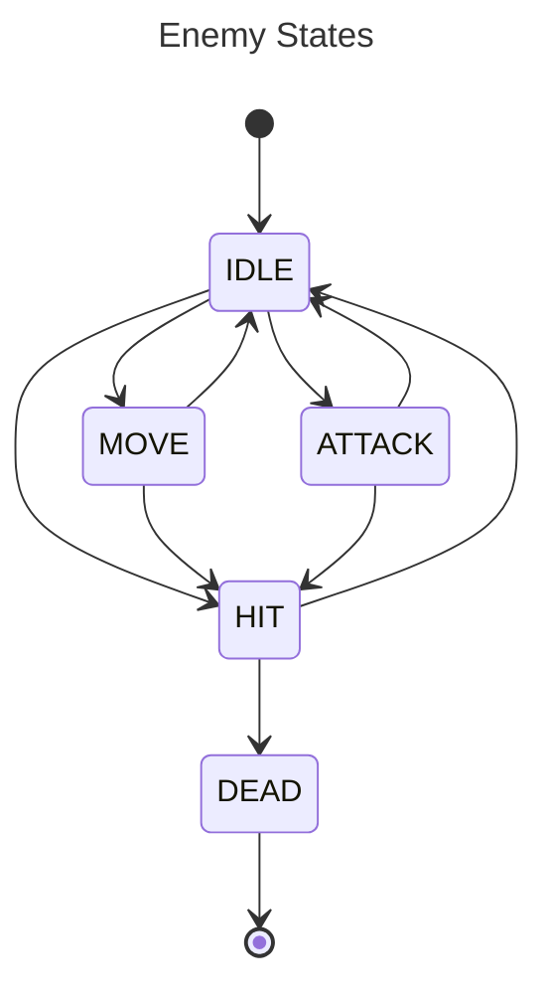
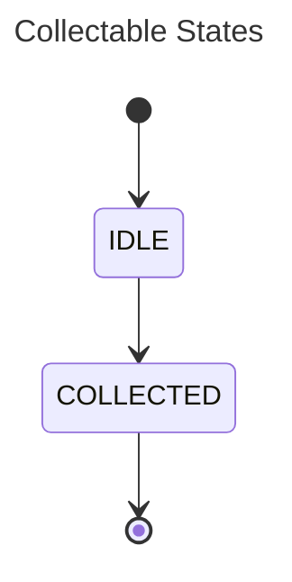

Chevy is a 2D game based on Java Swing.

You can download the latest release from this [link](https://github.com/bytestrick/chevy/releases/download/v1.0.0/chevy.jar). To run the game double-click on it. You need to have Java 21 or later installed on your system.

### Using Maven

Some useful life-cycle phases:

- `mvn clean` removes `target/` after the build
- `mvn compile` compiles the project
- `mvn exec:exec` runs the project after compilation
- `mvn package` produces the `jar` archive also containing the dependencies

The phases can be chained, e.g. `mvn clean compile` removes `target/` and recompiles the project from scratch.

> [!TIP]
> Running only `mvn` compiles and runs the app in one go.

The app can be installed on the Linux desktop (tested in Gnome) with the command `mvn install`. This will copy some files under the directory
`~/.local`. To uninstall the app and remove these files use the command `mvn clean -P uninstall`. Game saves will not be removed.

### Colors

The main menu uses a **monochromatic** palette based on purple (`HSB(280, 80, 60)`). Interface elements that are meant to stand out use **nearby colors**, blue and pink.

### Entities

Every `Entity` in the game is in a _state_ at any given time. The `StateMachine`, which is nothing but a [finite state machine](https://en.wikipedia.org/wiki/Finite-state_machine), manages the definition of states and edges that regulate the transition between them.

### Credits

- The ninja sprite is a modified version of [Superpowers Asset Packs](https://github.com/sparklinlabs/superpowers-asset-packs) (CC0)
- The look & feel for swing is [FlatLaf](https://www.formdev.com/flatlaf/) (Apache-2.0)
- The audio resources are all _royalty free_ and come from
  - [DungeonRush](https://github.com/rapiz1/DungeonRush/tree/master/res/audio)
  - [Pixabay](https://pixabay.com/)
- Interface font: [VT323](https://fonts.google.com/specimen/VT323)
- The character quotes on the main menu and the death dialog messages are generated by [ChatGPT](https://chatgpt.com/)
- Various resources come from [opengameart.org](https://opengameart.org/), the files are accompanied by the respective licenses.
- Some icons come from [flaticon.com](https://www.flaticon.com)
